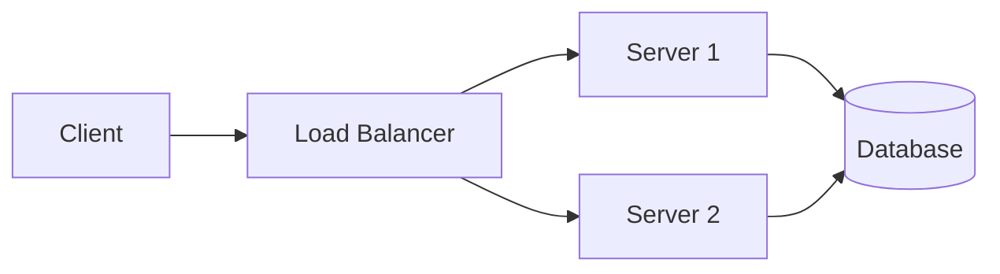
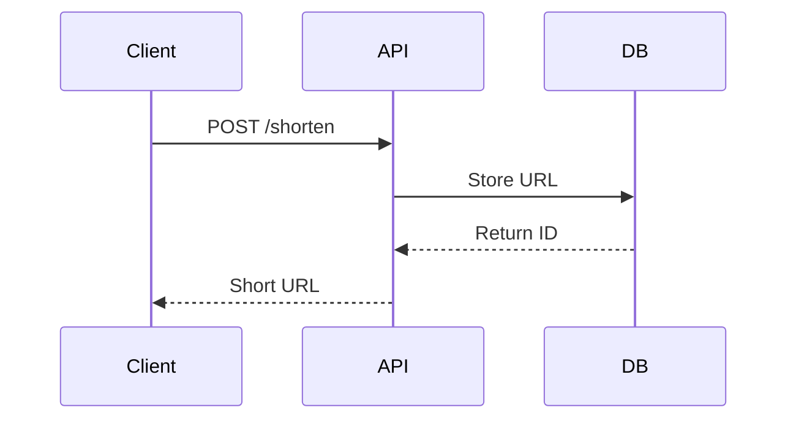

# Obsidian + GitHub Workflow Guide

> A comprehensive guide for taking system design notes using Obsidian with GitHub backup

---

## 📦 Initial Setup

### 1. Install Obsidian
- Download from [obsidian.md](https://obsidian.md)
- Create a new vault (folder) for your notes
- Recommended: Create vault inside your GitHub repo folder

### 2. GitHub Integration

#### Option A: Manual Git (Recommended for beginners)
```bash
# Initialize repo in your Obsidian vault
cd /path/to/your/vault
git init
git remote add origin https://github.com/username/repo.git

# Daily workflow
git add .
git commit -m "Notes: [topic]"
git push
```

#### Option B: Obsidian Git Plugin (Automated)
1. Go to **Settings → Community Plugins → Browse**
2. Search and install **"Obsidian Git"**
3. Configure auto-backup interval (e.g., every 10 minutes)
4. Set auto-pull on startup

**Recommended Plugin Settings:**
```
Auto backup interval: 10 minutes
Auto pull on startup: ON
Commit message: {{date}} - Auto backup
```

---

## 📁 Recommended Folder Structure

```
SystemDesign/
├── 📂 00-Index/
│   └── MOC-SystemDesign.md      # Map of Content (index)
├── 📂 01-Fundamentals/
│   ├── Scaling.md
│   ├── Load-Balancing.md
│   ├── Caching.md
│   ├── Databases.md
│   ├── CAP-Theorem.md
│   └── Consistent-Hashing.md
├── 📂 02-Components/
│   ├── Message-Queues.md
│   ├── CDN.md
│   ├── API-Gateway.md
│   └── Rate-Limiter.md
├── 📂 03-Designs/
│   ├── URL-Shortener.md
│   ├── Instagram.md
│   ├── Twitter.md
│   ├── Uber.md
│   └── Netflix.md
├── 📂 04-Templates/
│   └── Design-Template.md
├── 📂 assets/
│   └── images/                   # All screenshots here
└── 📂 Daily-Notes/               # Optional: daily learnings
```

---

## ✍️ Essential Markdown Syntax

### Headers
```markdown
# H1 - Main Title
## H2 - Section
### H3 - Subsection
#### H4 - Sub-subsection
```

### Text Formatting
```markdown
**bold text**
*italic text*
***bold and italic***
~~strikethrough~~
==highlighted text==          # Obsidian specific
```

### Lists
```markdown
- Bullet point
  - Nested bullet
    - Deep nested

1. Numbered list
2. Second item
   1. Nested number

- [ ] Unchecked task
- [x] Completed task
```

### Links
```markdown
[External Link](https://example.com)
[[Internal Note Link]]                    # Obsidian wiki-link
[[Note Name|Display Text]]                # Aliased link
[[Note Name#Heading]]                     # Link to specific section
```

### Images
```markdown

![[image-name.png]]                       # Obsidian embed
![[image-name.png|500]]                   # With width
```

### Code Blocks
````markdown
Inline `code` in sentence

```java
public class Solution {
    public static void main(String[] args) {
        System.out.println("Hello");
    }
}
```

```sql
SELECT * FROM users WHERE status = 'active';
```

```python
def calculate_qps(requests, seconds):
    return requests / seconds
```
````

### Tables
```markdown
| Component | Purpose | Example |
|-----------|---------|---------|
| Cache | Reduce latency | Redis, Memcached |
| Queue | Async processing | Kafka, RabbitMQ |
| CDN | Static content | CloudFront |
```

### Blockquotes & Callouts
```markdown
> Regular quote

> [!NOTE]
> Important information

> [!TIP]
> Helpful tip

> [!WARNING]
> Be careful about this

> [!IMPORTANT]
> Key concept to remember

> [!QUESTION]
> Something to think about
```

### Math (LaTeX)
```markdown
Inline math: $O(n \log n)$

Block math:
$$
QPS = \frac{DAU \times queries}{86400}
$$
```

### Horizontal Rule
```markdown
---
```

---

## 🔗 Obsidian-Specific Features

### 1. Backlinks `[[]]`
Connect related concepts:
```markdown
In [[Caching]], we discussed how [[Redis]] helps reduce [[Database]] load.
This is crucial for [[URL-Shortener]] design.
```

### 2. Tags
```markdown
#system-design #caching #interview
#status/in-progress
#difficulty/hard
```

### 3. Embeds
```markdown
![[Another Note]]              # Embed entire note
![[Note#Section]]              # Embed specific section
![[Note^block-id]]             # Embed specific block
```

### 4. Frontmatter (YAML)
Add metadata at the top of notes:
```yaml
---
title: URL Shortener Design
date: 2026-01-20
tags: [system-design, interview, hello-interview]
status: completed
difficulty: medium
source: Hello Interview
---
```

### 5. Mermaid Diagrams
````markdown



````

---

## 🎯 System Design Note-Taking Template

Use this template for each design problem:

```markdown
---
title: [System Name] Design
date: {{date}}
source: Hello Interview
status: in-progress
---

# [System Name] Design

## 1. Requirements Clarification

### Functional Requirements
- [ ] Requirement 1
- [ ] Requirement 2

### Non-Functional Requirements
- [ ] Scalability
- [ ] Availability
- [ ] Latency

## 2. Back-of-Envelope Estimation

| Metric | Calculation | Result |
|--------|-------------|--------|
| DAU | | |
| QPS | DAU × queries / 86400 | |
| Storage | | |

## 3. High-Level Design

![[system-name-hld.png]]

## 4. Component Deep Dive

### Database Choice
- Why: 

### Caching Strategy
- Why:

## 5. Key Algorithms

```java
// Key algorithm here
```

## 6. Trade-offs & Decisions

| Decision | Option A | Option B | Choice |
|----------|----------|----------|--------|
| | | | |

## 7. Follow-up Questions
- Q1:
- Q2:

## 8. Related Topics
- [[Related Topic 1]]
- [[Related Topic 2]]
```

---

## ⚡ Productivity Tips

### Keyboard Shortcuts (Mac)
| Action | Shortcut |
|--------|----------|
| Quick switcher | `Cmd + O` |
| Create new note | `Cmd + N` |
| Search in vault | `Cmd + Shift + F` |
| Toggle edit/preview | `Cmd + E` |
| Insert link | `Cmd + K` |
| Toggle checkbox | `Cmd + Enter` |
| Open command palette | `Cmd + P` |

### Recommended Plugins
1. **Obsidian Git** - Auto sync with GitHub
2. **Excalidraw** - Draw diagrams directly
3. **Dataview** - Query your notes like a database
4. **Templater** - Advanced templates
5. **Quick Add** - Rapid note capture
6. **Calendar** - Daily notes integration

### Daily Workflow
```
Morning:
1. Pull latest changes (auto with plugin)
2. Review yesterday's notes

During Study:
1. Create notes using templates
2. Take screenshots → paste directly (auto-saves to assets)
3. Link related concepts with [[]]

End of Session:
1. Add tags to new notes
2. Commit and push (auto with plugin)
```

---

## 🖼️ Handling Images/Screenshots

### Method 1: Direct Paste (Recommended)
1. Take screenshot (`Cmd + Shift + 4` on Mac)
2. Paste directly into Obsidian (`Cmd + V`)
3. Image auto-saves to vault

**Configure paste location:**
Settings → Files & Links → Default location for new attachments → `In subfolder under current folder` → `assets`

### Method 2: Drag and Drop
- Simply drag image into the note

### Method 3: Manual
```markdown

```

### Image Optimization for GitHub
- Keep images under 1MB when possible
- Use PNG for diagrams, JPG for screenshots
- Consider using a `.gitignore` for large files:
```
# .gitignore
*.psd
*.sketch
```

---

## 🔄 Git Workflow Cheatsheet

```bash
# Daily sync
git pull                          # Get latest
git add .                         # Stage all
git commit -m "Add: URL shortener notes"
git push                          # Upload

# View changes
git status                        # See modified files
git diff                          # See changes

# Undo mistakes
git checkout -- filename.md       # Discard changes to file
git reset HEAD~1                  # Undo last commit (keep changes)

# Branches (optional)
git checkout -b topic/caching     # New branch
git checkout main                 # Switch back
git merge topic/caching           # Merge branch
```

---

## ✅ Quick Start Checklist

- [ ] Download and install Obsidian
- [ ] Create vault in your GitHub repo folder
- [ ] Install **Obsidian Git** plugin
- [ ] Configure auto-backup (10 min interval)
- [ ] Set up folder structure
- [ ] Configure image paste location
- [ ] Create your first note using the template
- [ ] Test Git sync works

---

## 📚 Resources

- [Obsidian Documentation](https://help.obsidian.md)
- [Obsidian Git Plugin](https://github.com/denolehov/obsidian-git)
- [Mermaid Diagram Syntax](https://mermaid.js.org/syntax/flowchart.html)
- [Markdown Guide](https://www.markdownguide.org)

---

> 💡 **Pro Tip**: Start simple! Don't over-engineer your system. Begin with basic notes and evolve your structure as you learn what works for you.

Happy studying! 🚀
